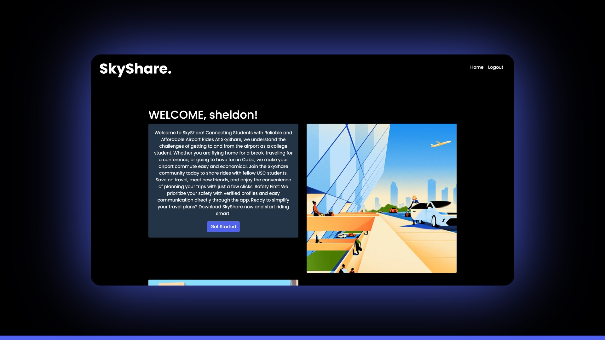
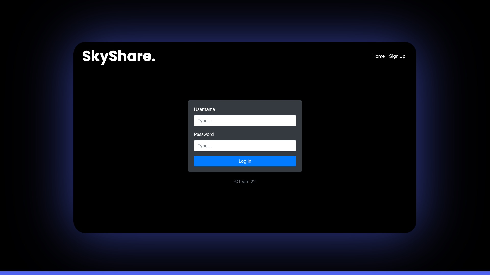
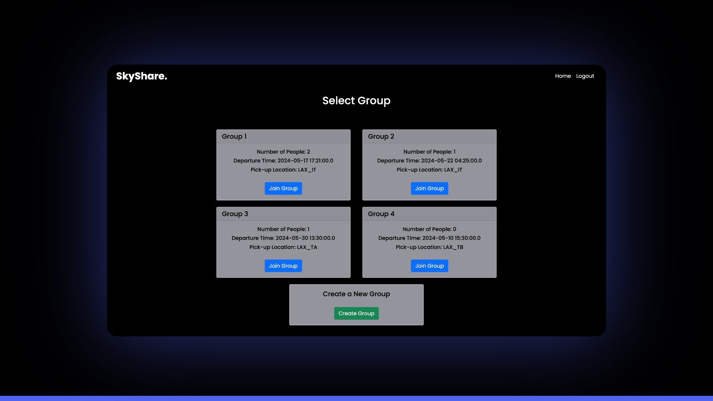
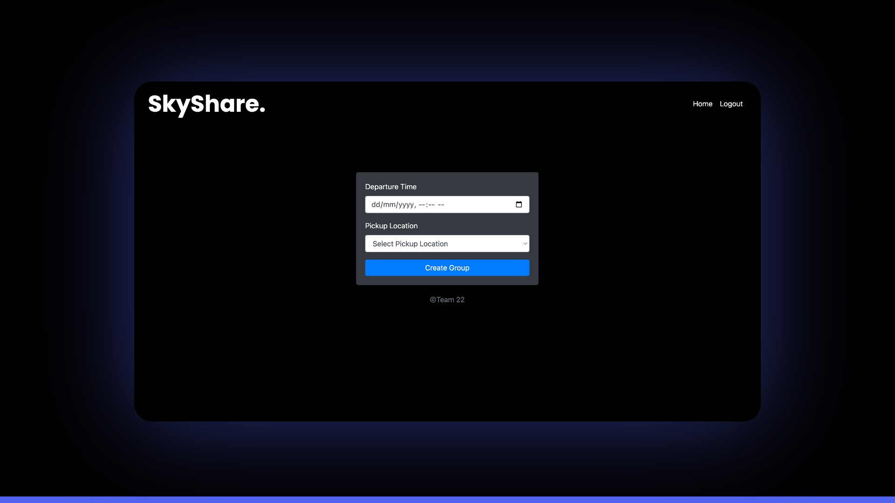
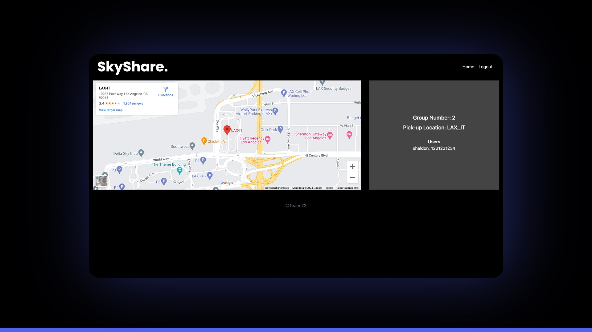

## About
SkyShare is a web application designed as a simple solution to finding safe and economical rides when they travel from LAX. Developed for USC CSCI201L group project,
this application is built using HTML, CSS, JavaScript, and Java with MySQL database. Bootstrap and jQuery were used to enhance user experience and page dynamics. 

## Features

* Login/Signup
* Search for groups
* Join groups
* View group
  
## Built With

## Tools Used 

## AWS Deployment
* Environment - Elastic Beanstalk
* Pipeline - CodePipeline
* Builder - CodeBuilder
* Database - RDS
  
Deployed URL (http://skyshare.us-west-1.elasticbeanstalk.com)

## Team
#### Project Architect
* Sherman Yan | [shermany@usc.edu](mailto:shermany@usc.edu) | [shermanyan](https://github.com/shermanyan)
#### Frontend Developers
* Jacob Rojit (Lead) | [rojit@usc.edu](mailto:rojit@usc.edu) | [jacobr004](https://github.com/jacobr004)
* Vaasvi Choudhary | [vaasvich@usc.edu](mailto:vaasvich@usc.edu) | [vaasvi](https://github.com/vaasvi)
* Parini Gandhi | [parinig@usc.edu](mailto:parinig@usc.edu) | [pg-19](https://github.com/pg-19)
* Yash Bansal | [ybansal@usc.edu](mailto:ybansal@usc.edu) | [ybansal777](https://github.com/ybansal777)
#### Backend Developers
* Siddarth Rudraraju (Lead) | [sr88018@usc.edu](mailto:sr88018@usc.edu) | [siddarth17](https://github.com/siddarth17)
* Ignacio Urbina Gonzalez | [urbinago@usc.edu](mailto:urbinago@usc.edu) | [urbinago](https://github.com/urbinago)
* Guillermo Basterra  | [basterra@usc.edu](mailto:basterra@usc.edu) | [guillebasterra](https://github.com/guillebasterra)

## Preview

